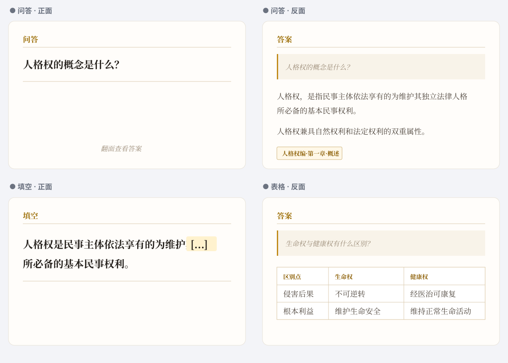

# QY 法硕 Anki 记忆卡片

面向 2027 法硕备考的学习卡片，适合在 Anki 中按章节背诵和复习。
个人用户下载后，除个别需要搭配其他插件使用的卡组，可直接双击apkg文件进行导入。
请勿倒卖，个人使用，不允许任何途径形式的倒卖商用。

## 2026-10-10 · 于越刑法母子题更新公告

> 于越母子题10.10全部更新完毕,题目答案彻底补全,25章渎职罪更新完毕,结构完整。

- 当前版本：**10.10 母子结构补全版**，共 **863张卡、88个题组，423道母题、440道子题**。
- 已对照解析PDF补齐原卡组中的空答案，清理混入题目、选项和解析的多余文字。
- 第24章贪污贿赂罪、第25章渎职罪的母题/子题角色、分组、章节与题组导图全部补齐，并补入这两章原卡组漏收的2道题。
- 清空PDF核对状态文字，移除“待补结构”目录；插件所需的唯一跳转标签已补齐。
- 两道历史真题的PDF明确写明“无正确选项”：保留历史答案说明，不将历史选项当作当前正确答案判分。
- 公共下载包不含个人复习记录。旧母子题版本移入归档，历史公共池资源继续保留；旧330题独立下载已撤下。

**下载：** [于越刑法母子题 · 10.10补全版](QY刑法母子题_母子结构补全版.apkg) · [母子题真跳转插件](QY母子题真跳转插件_v1%20(1).ankiaddon)

手机端可点击题组导图查看对应题目；桌面端需要实际跳转时，安装保留的插件并重启Anki，在复习界面使用导图。

Miki公共池沿用现有“QY 于越刑法母子题”条目，由独立Clean Publisher静态核对、生成不可变资源和SHA256校验后发布。插件文件保持原样。

- [下载 APKG](QY民法法硕Anki记忆卡片.apkg)
- [下载觉晓 5000 题刑法（偏基础）](觉晓5000题刑法（偏基础）.apkg)
- [下载觉晓 5000 题民法（偏基础）](觉晓5000题民法（偏基础）.apkg)
- [查看完整知识导图](https://mirrorlious.github.io/ankicardsfo1po/knowledge-map.html)

自动发布使用的清单、检查报告和状态记录集中存放在 `.miki/`；下载卡包无需查看这些文件。
